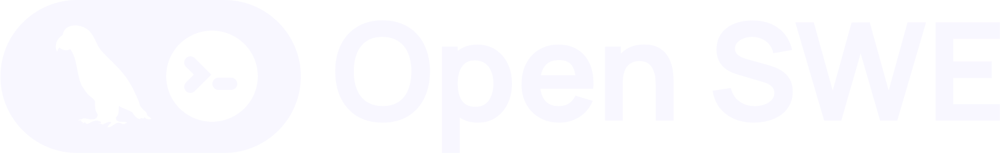

<div align="center">
  <a href="https://github.com">
    <picture>
      <source media="(prefers-color-scheme: dark)" srcset="assets/dark.svg">
      <source media="(prefers-color-scheme: light)" srcset="assets/light.svg">
      
    </picture>
  </a>
</div>

<div align="center">
  <h3>An open source software factory built on Deep Agents by Talal.</h3>
</div>

<div align="center">
  <a href="https://opensource.org/licenses/MIT" target="_blank"></a>
  <a href="https://github.com" target="_blank"></a>
  <a href="https://github.com" target="_blank"></a>
  <a href="https://github.com" target="_blank"></a>
</div>

<br>

Talal SWE turns engineering work into a repeatable system. Give it a code-change task from the dashboard, GitHub, Slack, or Linear to understand the codebase, make changes, validate them, and deliver a pull request.

## What Talal SWE does

- **Build:** Investigates repositories, edits code, runs validation, and opens pull requests.
- **Review:** Performs read-only pull request reviews and learns review styles.
- **Operate:** Runs tasks from the web dashboard, GitHub, Slack, and Linear with scheduling support.
- **Customize:** Configure models, tools, instructions, and integration workflows.

## Getting started

Complete the required configuration and clone the repository:

```bash
git clone https://github.com.git
cd Autonomous-Coding-Agent
uv venv
source .venv/bin/activate
```
